# SimpleAwait Repository Architecture

**Purpose:** implementation-oriented map of the repository  
**Scope:** SimpleAwait V1 as implemented in this repository  
**Audience:** maintainers, reviewers, and contributors  
**Last analyzed:** 2026-09-23

This document explains how the repository fits together: components, classes,
ownership, state transitions, runtime flows, platform boundaries, and validation.
It is a navigation and onboarding guide, not a replacement for the normative
documents.

Normative precedence remains:

1. [V1_API_CONTRACT.md](V1_API_CONTRACT.md)
2. [ARCHITECTURE.md](ARCHITECTURE.md)
3. [SimpleAwait_Implementation_Spec.md](SimpleAwait_Implementation_Spec.md)

## 1. System at a glance

SimpleAwait is a header-only, fixed-memory, cooperative coroutine runtime for
Arduino-class microcontrollers. Application code creates lazy `Task<void>`
objects and explicitly gives them to the process-wide `Scheduler`. The
application repeatedly calls `poll()` from Arduino `loop()`. Each poll is a
bounded scheduling pass: it samples time, resolves external signals, readies due
timers, and resumes only the tasks that were ready at the start of that pass.

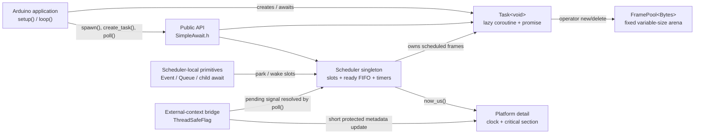

### Architectural character

- **Cooperative, not preemptive:** user code runs only when `poll()` resumes a
  coroutine.
- **Fixed-memory:** scheduler metadata is a fixed slot array; coroutine frames
  use a fixed arena; queue payload storage is inline.
- **Lazy:** calling a coroutine function allocates its frame but does not execute
  its body.
- **Explicit concurrency:** only `create_task()`, `spawn()`, or child `co_await`
  transfers a task into scheduler execution.
- **Deterministic:** capacity, overflow, invalid-use, and lifetime failures route
  through the configured error hook.
- **Scheduler-mediated:** wakeups enqueue work; they do not resume user code
  inline or from an ISR.

## 2. Repository map

```text
.
|-- src/
|   |-- SimpleAwait.h                  Public umbrella include
|   `-- simpleawait/
|       |-- task.h                     Task ownership and coroutine promise
|       |-- scheduler.h                Scheduler, slots, handles, ready/timer logic
|       |-- delay.h                    yield and delay awaitables
|       |-- event.h                    Manual-reset local event
|       |-- threadsafeflag.h           External/IRQ-to-scheduler signal bridge
|       |-- queue.h                    Bounded local FIFO and back-pressure
|       |-- waituntil.h                Predicate composition over yield
|       |-- diagnostics.h              Optional allocation-free statistics
|       |-- version.h                  Umbrella-included version constants
|       |-- config.h / error.h         Configuration and deterministic errors
|       `-- detail/
|           |-- frame_pool.h           Variable-size coalescing allocator
|           |-- global_frame_pool.h    Process-wide frame-pool instance
|           |-- platform_clock.h       Target clock selection
|           |-- platform_sync.h        Target critical-section selection
|           |-- time_math.h            Safe duration/deadline arithmetic
|           `-- coroutine_support.h    C++20 coroutine feature gate
|-- test/                               Deterministic host and negative tests
|-- examples/                           Eight golden API examples + skeleton
|-- extras/hardware/                    Target runtime validation sketches
|-- docs/simpleawait/                   Contracts, architecture, roadmap, spec
|-- .github/workflows/ci.yml            Host, sanitizer, target, and lint matrix
`-- CMakeLists.txt                      Header-only target and host-test entry
```

The public include surface is [src/SimpleAwait.h](../../src/SimpleAwait.h). It
aggregates the individual headers but declares no additional API.

## 3. Layering and dependency direction

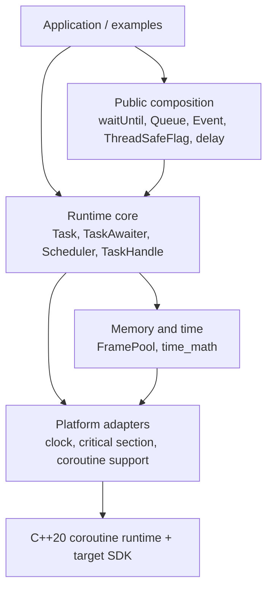

Dependencies point downward. The scheduler knows about task slots and wake
sources, but not application peripherals. `waitUntil()` is intentionally above
the scheduler: it is ordinary coroutine composition, not a scheduler feature.

## 4. Key class and type catalog

| Type | File | Responsibility | Owns memory or lifetime? |
|---|---|---|---|
| `Task<void>` | [task.h](../../src/simpleawait/task.h) | Move-only token for a lazy coroutine frame | Yes, until consumed |
| `Task<void>::promise_type` | [task.h](../../src/simpleawait/task.h) | Coroutine creation, suspension, completion, and frame allocation hooks | Allocates/deallocates through frame pool |
| `detail::TaskAwaiter` | [task.h](../../src/simpleawait/task.h) | Consumes a child task and transfers it to the scheduler | Temporarily owns child frame |
| `Scheduler` | [scheduler.h](../../src/simpleawait/scheduler.h) | Fixed-slot registry, ready FIFO, timers, poll pass, parking and waking | Owns every scheduled frame |
| `Scheduler::Slot` | [scheduler.h](../../src/simpleawait/scheduler.h) | Per-task control block: handle, links, parent, deadline, generation, state | Metadata only |
| `Scheduler::WaitQueue` | [scheduler.h](../../src/simpleawait/scheduler.h) | Intrusive FIFO used by `Event` waiters | No allocation; links slots |
| `TaskHandle` / `TaskId` | [scheduler.h](../../src/simpleawait/scheduler.h) | Generation-checked observational identity | Never owns a frame |
| `YieldAwaitable` | [delay.h](../../src/simpleawait/delay.h) | Requeues the running slot for a later pass | No |
| `DelayAwaitable` | [delay.h](../../src/simpleawait/delay.h) | Arms a deadline or performs a fair zero-delay yield | No |
| `Event` | [event.h](../../src/simpleawait/event.h) | Scheduler-local manual-reset, multi-waiter signal | Owns waiter queue metadata |
| `ThreadSafeFlag` | [threadsafeflag.h](../../src/simpleawait/threadsafeflag.h) | Single-waiter, coalescing bridge from supported external contexts | Owns signal and waiter linkage |
| `Queue<T, Capacity>` | [queue.h](../../src/simpleawait/queue.h) | Fixed-capacity FIFO, direct handoff, and sender back-pressure | Owns inline payload cells and awaiter links |
| `detail::FramePool<Bytes>` | [frame_pool.h](../../src/simpleawait/detail/frame_pool.h) | First-fit variable-size arena with coalescing | Owns the static frame arena |
| `detail::Micros32Extender` | [platform_clock.h](../../src/simpleawait/detail/platform_clock.h) | Compatibility extension of 32-bit `micros()` | Owns wrap state |
| `detail::CriticalSection` | [platform_sync.h](../../src/simpleawait/detail/platform_sync.h) | Target-specific short metadata protection | RAII protection only |
| `Stats` | [diagnostics.h](../../src/simpleawait/diagnostics.h) | Optional snapshot of scheduler and frame-pool counters | No |

### Core relationships

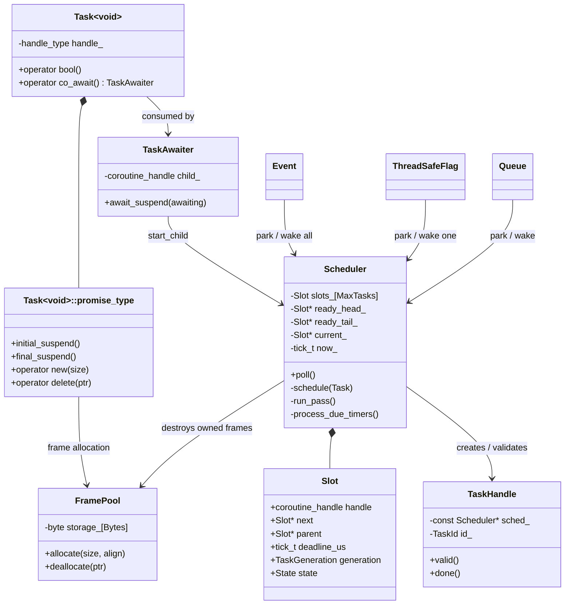

## 5. Coroutine frame ownership

Frame ownership is the central correctness invariant.

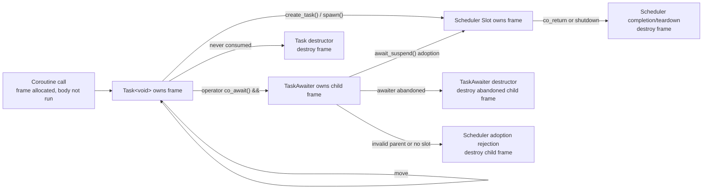

`TaskHandle` is excluded from this diagram because it is only an identity
observer. It stores a scheduler pointer and `(slot, generation)` pair, never a
frame handle.

### Allocation path

1. The compiler invokes `promise_type::operator new(size)`.
2. `detail::frame_pool()` returns the process-wide
   `FramePool<SIMPLEAWAIT_FRAME_POOL_BYTES>`.
3. The pool finds the first free block that satisfies payload size and alignment.
4. The coroutine starts at `initial_suspend()`, so the returned `Task<void>` is
   lazy.
5. On destruction, `promise_type::operator delete()` returns the block.
6. Adjacent free blocks coalesce, restoring capacity after arbitrary free order.

There is no global-heap fallback. Exhaustion reports
`Error::frame_pool_exhausted` and returns an empty task only if a custom
non-halting error hook returns.

## 6. Scheduler data model

The singleton returned by `scheduler()` owns:

- `slots_[SIMPLEAWAIT_MAX_TASKS]`: fixed task registry;
- `ready_head_` / `ready_tail_` / `ready_count_`: intrusive ready FIFO;
- `current_`: slot whose coroutine is currently executing;
- `active_count_`: scheduled frames not yet completed;
- `now_`: one sampled time value per poll pass;
- `nearest_deadline_`: timer fast-path cache;
- `in_poll_`: reentry guard;
- `shutting_down_`: teardown guard;
- optional `peak_count_`: diagnostics high-water mark.

Each `Slot` reuses its single `next` pointer for the ready FIFO or one local wait
queue. State exclusivity makes this safe and avoids separate queue nodes.

### Implemented slot states

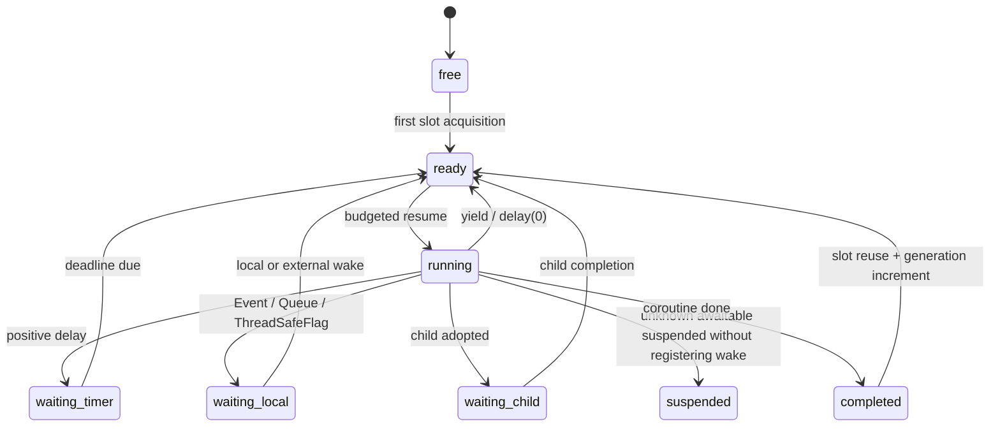

Implementation note: `ThreadSafeFlag` uses `waiting_local` through
`park_running()`. The `suspended` state is the scheduler's fallback when a
coroutine returns from `resume()` without an awaitable changing the slot state.

### Generation-safe identity

On every acquisition, including a free slot's first use, the slot generation
increments. Live tasks therefore start at generation 1 rather than the
default-initialized generation 0. A handle is valid only when its slot is in
range, generations match, and the slot is not `free`. Completed slots retain
tombstones so `done()` remains observable until reuse. A slot at `UINT32_MAX` is
retired instead of wrapping, preventing a stale handle from aliasing a future
task.

## 7. Exact `poll()` flow

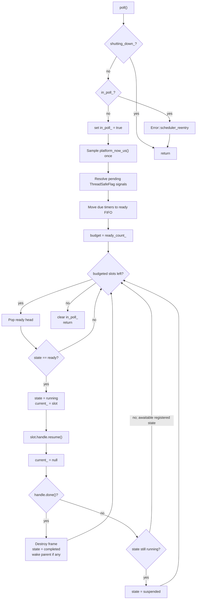

The budget snapshot is the fairness boundary. Tasks appended by a yield, wake,
timer, child completion, or queue transfer during `run_pass()` remain in the
ready FIFO for the next call to `poll()`. Scheduler teardown is outside this
runtime state graph: it detaches and destroys every live frame and marks its slot
`completed` without resuming user code.

## 8. Scheduling and child-await flows

### `create_task()` and `spawn()`

```mermaid
sequenceDiagram
    participant A as Application
    participant T as Task&lt;void&gt;
    participant S as Scheduler
    participant Q as Ready FIFO

    A->>T: coroutine_function()
    Note over T: frame allocated; initial_suspend
    A->>S: create_task(move(task)) or spawn(move(task))
    S->>S: acquire free/completed slot
    S->>T: take_frame()
    S->>Q: append slot
    S-->>A: TaskHandle or no return value
    Note over T,S: scheduler is now the sole frame owner
```

### Sequential child `co_await`

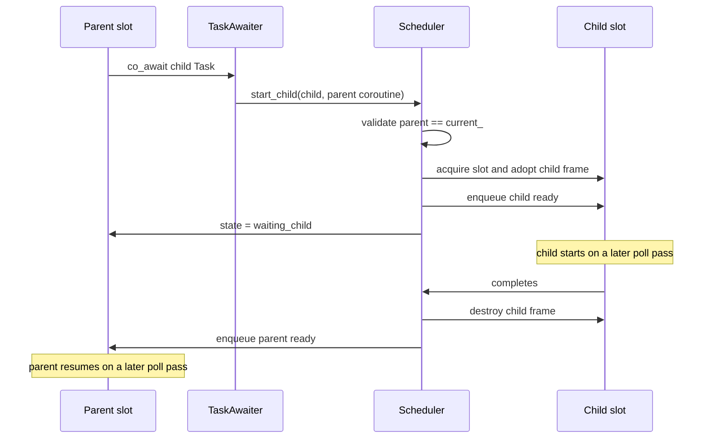

There is no symmetric transfer and no inline parent continuation.

## 9. Time and delays

All internal time is `uint64_t` microseconds (`detail::tick_t`).

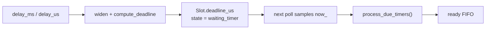

- Milliseconds widen to 64 bits before multiplication.
- `now + duration` is checked before addition.
- `delay(0)` calls the same requeue path as `yield()`.
- The timer container is the slot array itself.
- `nearest_deadline_` makes the no-timer-due path O(1).
- When timers are due, selection is by earliest deadline; slot order breaks
  equal-deadline ties.

Clock backend selection:

| Build | Source |
|---|---|
| RP2040 / RP2350 | `time_us_64()` |
| ESP32 family | `esp_timer_get_time()` |
| Generic Arduino | software-extended `micros()` |
| Host tests | injected `SIMPLEAWAIT_CLOCK_NOW_US()` |
| Opt-in host adapter | `std::chrono::steady_clock` |

`SIMPLEAWAIT_CLOCK_NOW_US()` has first precedence and overrides every target
backend. A host build with neither that override nor
`SIMPLEAWAIT_HOST_REALTIME_CLOCK` intentionally has no clock definition, so
using scheduler timing fails at link time instead of silently selecting wall
clock time.

## 10. Synchronization and messaging

### Event

`Event` is manual-reset and scheduler-local.

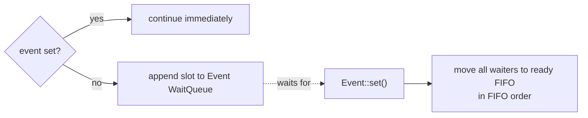

`set()` latches the event; `clear()` affects later waits. There is deliberately
no ISR-safe Event method.

### ThreadSafeFlag

`ThreadSafeFlag` separates external metadata updates from scheduler work.

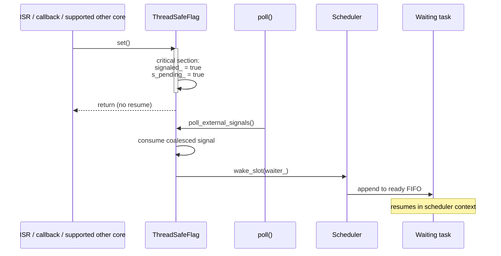

It is single-waiter, auto-reset on consumption, and coalescing. Armed flags form
a scheduler-context intrusive list; external code changes only protected signal
metadata.

### Queue

`Queue<T, Capacity>` supports blocking awaitables and non-blocking probes:

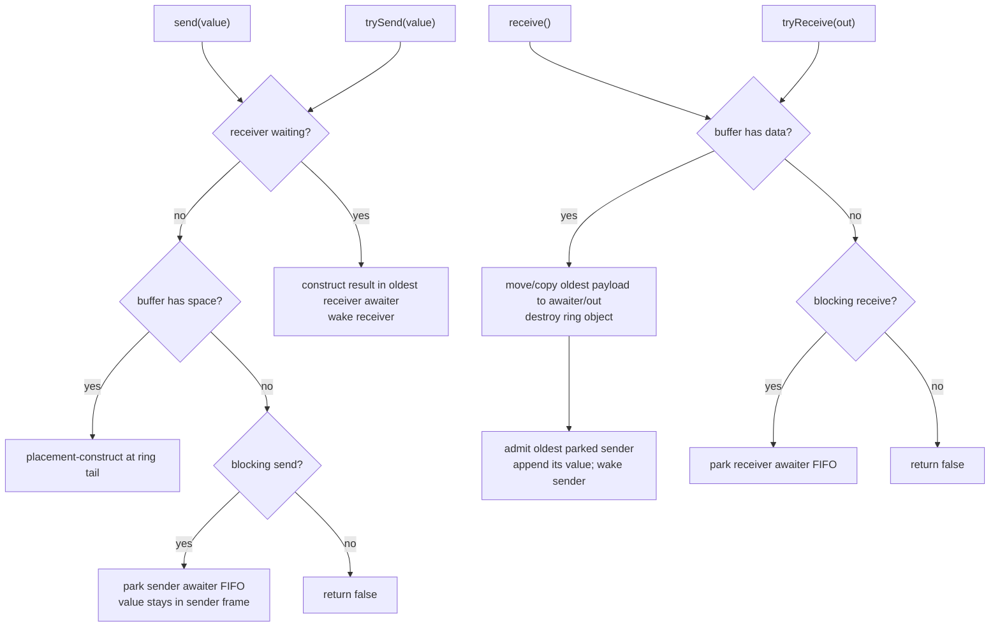

Payload cells are aligned raw storage. Objects are placement-constructed only
when occupied and explicitly destroyed when removed, so `T` need not be
default-constructible. Sender and receiver waiters live in coroutine frames and
unlink themselves if a parked frame is destroyed.

### `waitUntil`

`waitUntil(predicate)` adds no scheduler state:

```cpp
while (!predicate()) {
    co_await yield();
}
```

The predicate lives by value in the coroutine frame and is evaluated once per
poll pass at a fair yield point.

## 11. Platform boundary

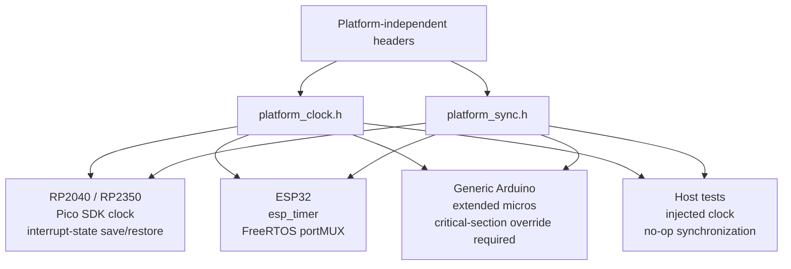

The shipped RP backend guarantees same-core IRQ exclusion for
`ThreadSafeFlag::set()`. Cross-core RP signaling requires a supplied override.
The ESP32 `portMUX` backend covers IRQ and multicore access. A generic Arduino
build without a safe override fails at compile time rather than emitting an
unsafe bridge.

`SIMPLEAWAIT_ENABLE_ISR` is part of the frozen configuration surface, but the
current headers do not use it to compile `ThreadSafeFlag` or external-signal
polling in or out; the bridge is currently present regardless of the macro's
value.

SimpleAwait tasks are not FreeRTOS tasks. `spawn()` and `create_task()` never
call `xTaskCreate()`.

## 12. Error and shutdown model

The core does not rely on exceptions. `SIMPLEAWAIT_ON_ERROR(error)` is the
single deterministic reporting hook. The default aborts on host and halts on
embedded targets.

Important error classes include:

- resource limits: `task_limit`, `frame_pool_exhausted`;
- scheduler misuse: `scheduler_reentry`, `invalid_task`;
- task misuse: `task_awaited_twice`;
- primitive misuse: `multiple_flag_waiters`,
  `object_destroyed_with_waiters`;
- arithmetic/runtime faults: `deadline_overflow`, `unhandled_exception`,
  `internal_error`.

During scheduler destruction, `shutting_down_` is set first. Each slot is
detached before its frame is destroyed so parameter destructors cannot reenter
and observe a still-owned frame. `poll()` becomes a no-op and new scheduling is
refused during teardown.

## 13. Diagnostics

With `SIMPLEAWAIT_ENABLE_DIAGNOSTICS=1`, `stats()` combines:

- scheduler counts: active, peak, ready, waiting timers;
- frame-pool counts: used, peak used, free, allocation failures.

The default build compiles out the public diagnostics surface and the scheduler
high-water counter.

## 14. Build and validation architecture

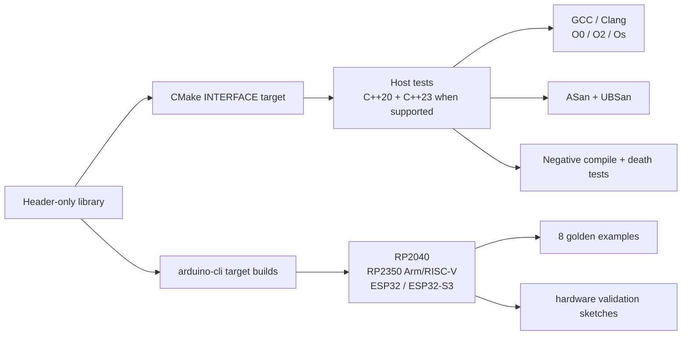

The [test/CMakeLists.txt](../../test/CMakeLists.txt) suite covers lifecycle,
ownership edges, scheduler behavior, timer ordering and overflow, child awaits,
Event, ThreadSafeFlag, Queue, diagnostics, shutdown, stress, ODR behavior,
negative compilation, and deterministic fatal paths.

The [CI workflow](../../.github/workflows/ci.yml) runs:

- GCC and Clang host tests at `-O0`, `-O2`, and `-Os`;
- ASan and UBSan;
- C++20 and C++23 where supported;
- target compilation across the five first-class board configurations;
- all golden examples and hardware validation sketches;
- Arduino metadata/lint gates.

Host tests establish deterministic runtime behavior. Target compilation proves
toolchain compatibility, not hardware runtime correctness. The repository
provides on-device sketches and procedures in
[extras/hardware/README.md](../../extras/hardware/README.md), but does not store
a per-board execution-results ledger; hardware runtime validation remains a
separate release obligation.

## 15. End-to-end application flow

```mermaid
sequenceDiagram
    participant Setup as setup()
    participant App as Application task
    participant Pool as FramePool
    participant S as Scheduler
    participant Loop as loop()
    participant Plat as Platform clock

    Setup->>App: worker()
    App->>Pool: allocate coroutine frame
    Pool-->>Setup: lazy Task&lt;void&gt;
    Setup->>S: spawn(task)
    S->>S: adopt frame into ready slot

    loop Runtime
        Loop->>S: poll()
        S->>Plat: now_us()
        S->>S: external signals + due timers
        S->>App: resume once if in pass budget
        App->>S: awaitable registers next wake source
        S-->>Loop: bounded pass returns
    end
```

The Arduino loop remains in control. Long-running or blocking application code
inside a task blocks every other SimpleAwait task because scheduling is
cooperative.

## 16. Maintainer checklist

When changing the runtime, verify:

1. exactly one owner exists for every live frame;
2. a slot is linked into at most one intrusive queue;
3. no wake path resumes user code inline;
4. newly readied tasks wait for a later poll pass;
5. stale handles cannot alias reused slots;
6. timers use the single sampled 64-bit clock value;
7. external contexts touch only protected signal metadata;
8. fixed-capacity failures remain explicit and deterministic;
9. queue payload construction/destruction remains balanced;
10. C++20, no-exception, header-only, and multi-TU behavior remain intact;
11. host tests and relevant target builds cover the changed subsystem;
12. public API changes update the normative contract before implementation.
